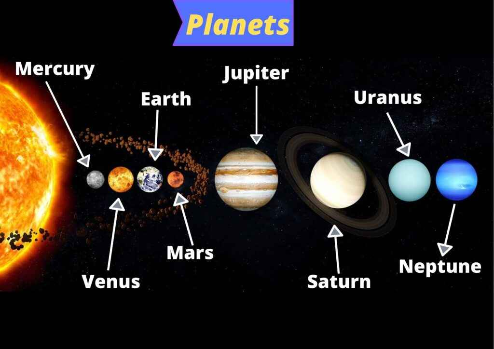

This practical is all about

```{r echo=FALSE, fig.align = 'center'}

```

**Warning**: Before you can knit this file, download the image “planets.jpg” and place it in the same folder as your Rmd file.

# **Instructions**
Copy-paste the text of this practical in an Rmd file called “Practical 2” and render an html document with:

+ the text formatted identically to that in the original

+ theme “journal” and highlight “espresso”

+ a floating numbered TOC of depth 2

+ no hashtag symbols preceding each line of R output

+ the centered image “planets.jpg”

Test the R code in each chunk within your Rmd file, and regularly knit the html to check for errors.

Consult the Base R Cheat Sheet and the R Markdown Cheat Sheet for help.

# **Data objects**
## **Vectors**
Below you see code that makes 5 vectors containing information about planets. Run this code in your Rmd file, and check the classes of these vectors in your workspace.

```{r}
name     <- c("Mercury", "Venus", "Earth", "Mars", 
              "Jupiter", "Saturn", "Uranus", "Neptune")

type     <- factor(c("Terrestrial planet", "Terrestrial planet", 
                     "Terrestrial planet", "Terrestrial planet", "Gas giant", 
                     "Gas giant", "Gas giant", "Gas giant"))

diameter <- c(0.382, 0.949, 1, 0.532, 11.209, 9.449, 4.007, 3.883)

rotation <- c(58.64, -243.02, 1, 1.03, 0.41, 0.43, -0.72, 0.67)

rings    <- c(FALSE, FALSE, FALSE, FALSE, TRUE, TRUE, TRUE, TRUE)
```

Display the 2nd element of rotation.

```{r}
rotation[2]
```

Display the 1st and 2nd elements of name.

```{r}
name[1:2]
```

Display the 1st and 6th elements of type.

```{r}
type[c(1, 6)]
```

Display a logical vector that has value TRUE when diameter > 1 and value FALSE otherwise.

```{r}
diameter > 1
```

Display the names of the planets with a diameter greater than 1.

```{r}
name[diameter > 1]
```

## **Matrices**
Collect the above five vectors in a matrix called planets, and display the result.

```{r}
planets <- cbind(name, type, diameter, rotation, rings)
planets
```

Display the classes of the columns of planets with the function apply().

```{r}
apply(planets, 2, class)
```

Remake the matrix planets (overwrite the previous version) using only the vectors the four vectors type, diameter, rotation and rings, and then add the vector name to the matrix as row names. Display the result.

```{r}
planets <- cbind(type, diameter, rotation, rings)
rownames(planets) <- name
planets
```

Again, display the classes of the columns of the matrix planets. What is the difference with the previous version?

```{r}
apply(planets, 2, class)

#Compared to the previous version, the columns of the new version of the matrix planets all have a numeric class instead of a character class.
```

Display the 3rd column of the matrix planets as vector.

```{r}
planets[, 3]
```

Display the 3rd column of the matrix planets as a matrix.

```{r}
cbind(planets[, 3, drop = FALSE])
```

Display the row of planets corresponding to “Venus”.

```{r}
planets["Venus", ]
```

Display the elements in the 3rd row and the 2nd and 3rd columns of planets.

```{r}
planets[3, 2:3]
```

Display planets leaving out the 1st row and 1st column.

```{r}
planets[-1, -1]
```

## **Data frames**
Make a data frame called planets_df containing all five vectors as variables.

Display the classes of the variables in planets_df with the function sapply().

```{r}
planets_df <-data.frame(name, type, diameter, rotation, rings)
sapply(planets_df, class)
```

Display the variable type from planets_df as a vector.

```{r}
planets_df[, "type"]
```

Display the variable type from planets_df as a data frame.

```{r}
planets_df[, "type", drop = FALSE]
```

Display the 5th element of the variable name using a dollar sign and square brackets.

```{r}
planets_df$name[5]
```

## **Lists**
Make a list called planet_list with its 1st element called “matrix” containing the matrix planets, and its 2nd element called “data frame” (make sure to add the space between “data” and “frame”) containing the data frame “planet_df”.

```{r}
planet_list <- list(matrix = planets, "data frame" = planets_df)
```

Display the 2nd list element.

```{r}
planet_list[[2]]
```

Display the list element called “matrix”.

```{r}
planet_list[["matrix"]]
```

Display the variable “rotation” of the list element “planets_df” as data frame.

```{r}
planet_list[["data frame"]]["rotation"]
```

Display the 2nd element of the variable “rotation” of the list element “planets_df”.

```{r}
planet_list[["data frame"]]$rotation[2]
```

Add a 3rd element called “my name” to planets_list containing your name.

```{r}
planet_list <- c(planet_list, "my name" = "jodi")
```

When finished, check if the html knit succesfuly, and submit your Rmd file to Blackboard before the deadline.

End of practical