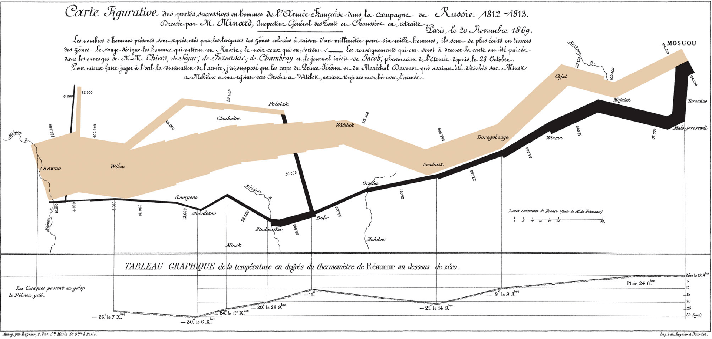

```{r setup, include=FALSE}
knitr::opts_chunk$set(warning = FALSE, message = FALSE) 
```

Below you see one of the data visualizations, depicting the march of Napoleon’s army to Moscow. The width of the march shows the number of soldiers over time: the march started with half a million, and ended with then thousand. At the time, it was considered one of the best visualizations ever.

```{r fig.align='center'}

```

Nowadays we have better ways to make visualizations. For this practical, you need the packages ggplot2, dplyr, and gridExtra. For displaying multiple ggplot() plots in a single array, use grid.arrange() from the gridExtra package. If necessary, use the chunk options fig.width, fig.height, and/or fig.asp to display the plots in a nice format.

```{r message=FALSE}
library(ggplot2)
library(dplyr)
library(gridExtra)
data("diamonds")
```

For a quick reference of ggplot2 functions, consult

+ [ggplot2 Cheatsheet](https://github.com/rstudio/cheatsheets/blob/main/data-visualization-2.1.pdf)

+ [ggplot2 Reference](https://ggplot2.tidyverse.org/reference/index.html)

Style guide: start a new line after each ggplot + (so for each new layer)

---

## The diamonds data

The dataset for this practical is diamonds from the package ggplot2.

  a. Check the help page of this tibble for its content, and display the first 10 rows of the data in your HTML.

```{r}
head(diamonds, 10)
```

The diamonds dataset has more than 50.000 rows, which is a lot. To simplify matters, we will work with a random sample of 500 cases.

  b. Set the seed to 100, and randomly sample 500 cases from the dataset diamonds using the slice_sample() function. Save the resulting data set as my_diamonds.

```{r}
set.seed(100)
diamonds %>%
  slice_sample(n = 500) ->
  my_diamonds
```

## One continuous variable

Some geoms for a single continuous variable automatically display the message

This message does not mean that the default of 30 bins is necessarily bad. Hadley Wickham included this message because he feels that you should always experiment with the binwidth argument to see what gives the best picture of the distribution. So, you can use the default if the plot looks OK to you. Otherwise, try different values for binwidth until you are happy with the result.

  a. In a 2 x 3 plot array, plot the variable carat using the six different geoms for one continuous variable listed on the data visualization cheat sheet. Add a title with the name of the appropriate geom to each plot.

```{r}
area <- ggplot(my_diamonds, aes(carat)) + 
  geom_area(stat = "bin") +
  ggtitle("Area")
  
density <- ggplot(my_diamonds, aes(carat)) +
  geom_density(kernel = "gaussian") +
  ggtitle("Density")
  
dot <- ggplot(my_diamonds, aes(carat)) +
  geom_dotplot() +
  ggtitle("Dot Plot")
  
frequency <- ggplot(my_diamonds, aes(carat)) +
  geom_freqpoly() +
  ggtitle("Frequency")

histogram <- ggplot(my_diamonds, aes(carat)) +
  geom_histogram(binwidth = 0.05) +
  ggtitle("Histogram")
  
qq <- ggplot(my_diamonds) +
  geom_qq(aes(sample = carat)) +
  ggtitle("QQ Plot")

grid.arrange(area, density, dot, frequency, histogram, qq, ncol = 3)
```

Strangely enough, the boxplot and violinplot are not listed in the cheat sheet section for one continuous variable.

  b. In a 1 x 2 plot array, display these plots for carat. (The violin plot requires the specification of both x and y aesthetics; for one of these you can use a scalar of your own choice.)
  
```{r}
box <- ggplot(my_diamonds, aes(carat)) +
  geom_boxplot()
 
violin <- ggplot(my_diamonds, aes(carat, price)) +
  geom_violin(scale = "area")

grid.arrange(box, violin, ncol = 2)
```

## One discrete variable

Discrete variables are variables with countable values (i.e. categorical variables or variables with integer values). The distributions of such variables are best displayed with barplots.

  a. Display the barplots of the three factors in my_diamonds, in a 1 x 3 plot array. Make sure that the labels of the categories are readable (i.e., not overlapping).
  
```{r}
cut <- ggplot(my_diamonds, aes(cut)) +
  geom_bar() +
  scale_x_discrete(guide = guide_axis(check.overlap = TRUE))

color <- ggplot(my_diamonds, aes(color)) +
  geom_bar() + 
  scale_x_discrete(guide = guide_axis(check.overlap = TRUE))

clarity <- ggplot(my_diamonds, aes(clarity)) +
  geom_bar() +
  scale_x_discrete(guide = guide_axis(check.overlap = TRUE))

grid.arrange(cut, color, clarity, ncol = 3)
```

  b. Make the same plots as above with geom_col(). This geom requires a table as input and the specification of x and y aesthetics: the levels of the variable and the observed frequencies. Use the pipe operator in combination with the dplyr function count() to make the table. Do not store any intermediate data objects.
  
```{r}
my_diamonds %>%
  count(cut) %>%
  ggplot(aes(x = cut, y = n)) +
  scale_x_discrete(guide = guide_axis(check.overlap = TRUE)) +
  geom_col() ->
  cut_2

my_diamonds %>%
  count(color) %>%
  ggplot(aes(x = color, y = n)) +
  scale_x_discrete(guide = guide_axis(check.overlap = TRUE)) +
  geom_col() ->
  color_2

my_diamonds %>%
  count(clarity) %>%
  ggplot(aes(x = clarity, y = n)) +
  scale_x_discrete(guide = guide_axis(check.overlap = TRUE)) +
  geom_col() ->
  clarity_2

grid.arrange(cut_2, color_2, clarity_2, ncol = 3)
```

## Two variables

We will start by displaying the joint distribution of a discrete variable and a continuous variable. Common choices of plots for these types of variables are the boxplot, the violinplot, and the dotplot. These plots differ in how they represent the details of the distribution.

  a. Display a boxplot, a violinplot, and a dotplot of price and cut in a 2 x 2 plot array. Use the argument layout_matrix (instead of nrow) in the grid.arrange() function to plot the boxplot and violinplot side-by-side, in the first row and to plot the dotplot over the full length of the second row. See Arranging multiple grobs on a page: Complex layouts for examples of using layout_matrix.
  
```{r}
boxplot <- ggplot(my_diamonds, aes(x = cut, y = price)) +
  geom_boxplot() +
  scale_x_discrete(guide = guide_axis(check.overlap = TRUE))

violinplot <- ggplot(my_diamonds, aes(x = cut, y = price)) +
  geom_violin() +
  scale_x_discrete(guide = guide_axis(check.overlap = TRUE))

dotplot <- ggplot(my_diamonds, aes(y = price, x = cut)) +
  geom_dotplot(binaxis = "y", stackdir = "center") +
  coord_flip()

grid.arrange(boxplot, violinplot, dotplot, layout_matrix = rbind(c(1, 2), c(3, 3)), ncol = 2)

```

The joint distribution of two discrete variables is best depicted with barplots or the geom_count() function.

  b. Display a stacked, a dodged, and a filled barplot of color with colors defined by the levels of clarity in a 1 x 3 plot array.

```{r}
stacked <- ggplot(my_diamonds, aes(x = color, fill = clarity)) +
  geom_bar(position = "stack") +
  scale_x_discrete(guide = guide_axis(check.overlap = TRUE))

dodged <- ggplot(my_diamonds, aes(x = color, fill = clarity)) +
  geom_bar(position = "dodge") +
  scale_x_discrete(guide = guide_axis(check.overlap = TRUE))

filled <- ggplot(my_diamonds, aes(x = color, fill = clarity)) +
  geom_bar(position = "fill") +
  scale_x_discrete(guide = guide_axis(check.overlap = TRUE))

grid.arrange(stacked, dodged, filled, ncol = 3)
```

  c. Plot the same variables with geom_count().

```{r}
counts <- my_diamonds %>%
  count(color, clarity)

stacked_count <- ggplot(counts, aes(x = color, y = n, fill = clarity)) +
  geom_count(position = "stack") +
  scale_x_discrete(guide = guide_axis(check.overlap = TRUE))

dodged_count <- ggplot(counts, aes(x = color, y = n, fill = clarity)) +
  geom_count(position = "dodge") +
  scale_x_discrete(guide = guide_axis(check.overlap = TRUE))

filled_count <- ggplot(counts, aes(x = color, y = n, fill = clarity)) +
  geom_count(position = "fill") +
  scale_x_discrete(guide = guide_axis(check.overlap = TRUE))

grid.arrange(stacked_count, dodged_count, filled_count, ncol = 3)
```

The joint distribution of two continuous variables is best depicted with a scatterplot. The scale on which the x- and y-axes are displayed can be changed with scale_x_...() and scale_y_...() (search the help files to find information on the different flavors of these functions).

  d. Display a scatterplot of price and carat in a 1 x 2 plot array. Create one plot with the axes on the original scale and one with the axes on a logarithmic scale (i.e., log base 10). In both plots, add a smoothed regression line (i.e., a loess line), and suppress the grey ribbon for the standard error. Since there is some overplotting, set alpha to 0.1.

```{r}
scatter_og <- ggplot(my_diamonds, aes(x = carat, y = price)) +
  geom_point(alpha = 0.1) +
  geom_smooth(method = "lm", se = FALSE)

scatter_log <- ggplot(my_diamonds, aes(x = carat, y = price)) +
  geom_point(alpha = 0.1) +
  geom_smooth(method = "lm", se = FALSE) +
  scale_y_log10()

grid.arrange(scatter_og, scatter_log, ncol = 2)
```

## Three variables

More variables can be added to a scatterplot with aesthetics like size, shape, and color. Size is suited for continuous variables, shape for discrete variables, and color for both. Shape however, only works for variables with a small number of levels. Therefore we will do the following exercises with a subset of my_diamonds wherein cut takes the values fair or ideal.

  a. Subset my_diamonds as described above, reproduce the 2nd scatterplot from exercise 5d (with carat and price but without the regression line), and display this scatterplot in a 3 x 1 plot array. In each plot, map a different one of the variables z, cut, and color to an appropriate aesthetic (i.e., size, shape, or color). Use alpha in case of overplotting.

```{r}
ss_my_diamonds <- my_diamonds %>% 
  filter(cut %in% c("Fair", "Ideal"))

scatter_log <- ggplot(ss_my_diamonds, aes(x = carat, y = price)) +
  geom_point(aes(color = cut, size = z), alpha = 0.5) +
  scale_y_log10() +
  labs(color = "Cut", size = "Z")

z_color <- ggplot(ss_my_diamonds, aes(x = carat, y = price, color = z)) +
  geom_point(alpha = 0.5) +
  scale_y_log10() +
  labs(color = "Z")

cut_shape <- ggplot(ss_my_diamonds, aes(x = carat, y = price, shape = cut)) +
  geom_point(alpha = 0.5, size = 3) +
  scale_y_log10() +
  labs(shape = "Cut")

grid.arrange(scatter_log, z_color, cut_shape, nrow = 3)
```

  b. Reproduce the scatterplot from the previous exercise twice, in a 1 x 2 plot array, but do not map any aesthetics to the z, cut, or color variables. Add smoothed regression lines for cut and color, respectively, to the two plots (i.e., add one line to each plot).

```{r}
scatter_log_cut <- ggplot(ss_my_diamonds, aes(x = carat, y = price)) +
  geom_point(alpha = 0.5) +
  geom_smooth(aes(color = cut), method = "lm", se = FALSE) +
  scale_y_log10()

scatter_log_color <- ggplot(ss_my_diamonds, aes(x = carat, y = price)) +
  geom_point(alpha = 0.5) +
  geom_smooth(aes(color = color), method = "lm", se = FALSE) +
  scale_y_log10()

grid.arrange(scatter_log_cut, scatter_log_color, ncol = 2)
```

The regression lines in the 2nd plot of the previous exercise are difficult to distinguish. We can also use faceting to represent this information.

  c. Display the 2nd plot of the previous exercise (the one with separate regression lines for color) as an array of conditional plots with facet_grid(). Do not use different colors for the categories of color.

```{r}
ggplot(ss_my_diamonds, aes(x = carat, y = price)) +
  geom_point(alpha = 0.5) +
  geom_smooth(method = "lm", se = FALSE) +
  scale_y_log10() +
  facet_grid(. ~ color)
```

  d. Do the same as in the previous exercise, but now use facet_wrap().

```{r}
ggplot(ss_my_diamonds, aes(x = carat, y = price)) +
  geom_point(alpha = 0.5) +
  geom_smooth(method = "lm", se = FALSE) +
  scale_y_log10() +
  facet_wrap(~ color)
```

  e. Reproduce the previous plot, but now display it with linear regression lines and use the minimal theme.

```{r}
ggplot(ss_my_diamonds, aes(x = carat, y = price)) +
  geom_point(alpha = 0.5) +
  geom_smooth(method = "lm", se = FALSE) +
  scale_y_log10() +
  facet_wrap(~ color) +
  theme_minimal()
```

---

End of practical